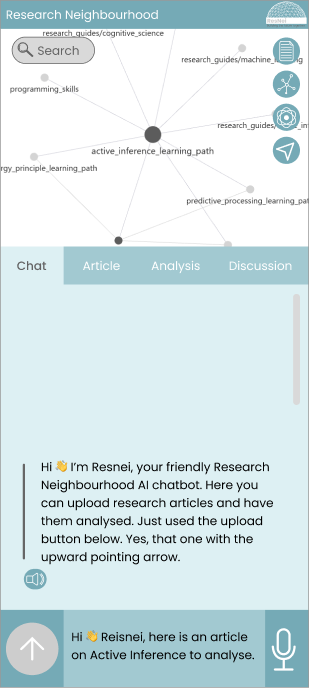

# ResNei

Research Neighborhood

Rhizomes are interconnected rooted vegetables that grow laterally. Similarly our team grows ideas sideways—remotely, asynchronously, sometimes chaotically—but always connected through shared questions, determined inquiry, and the belief that knowledge grows better together.

Version 1.0 ~ May 12, 2025 ~ 10.5281/zenodo.15389683  
Contact: [blanket@activeinference.institute](mailto:blanket@activeinference.institute) ~ [http://resnei.activeinference.institute/](https://www.google.com/url?q=http://resnei.activeinference.institute/&sa=D&source=editors&ust=1750107609993463&usg=AOvVaw0LEl0z3-oJG1qVWPnNk8Q0) 

Concept and flow diagrams are made with [Napkin.ai](https://www.google.com/url?q=http://napkin.ai&sa=D&source=editors&ust=1750107609994285&usg=AOvVaw3UJvPJ3vssI7Fl6H5YVWnv).

* * *

# Solution Design Document

ResNei — Research Neighbourhood – is an AI-augmented environment designed to transform how we discover, analyse, and connect ideas.

At its core is the Research Discovery Engine, which constructs a living, responsive knowledge graph through the distillation of verified concepts and the dynamic linking of an evolving corpus of scientific knowledge. This graph is structured as a set of Conceptual Nexus Models (CNMs)—modular representations of connected ideas, designed to surface signals to support impactful inquiry and collaboration.

Our UX design moves away from conventional passive, attention-driven systems toward a dynamic, action-intention model that centres collaboration, responsiveness, and contextual insight. A world where research becomes not just efficient, but responsive, intuitive, and interconnected.

This platform aims to scale research processes through the interplay of generalists and specialists. Our platform involves a graphical concept model, enabling specialists to engage with reliable evaluation of scientific output, while democratising the otherwise intractable web of knowledge for the generalist. The co-evolution of expert-lead early adoption with generalist participation drives insight and growth: where research thrives through their collaboration. Grounded in scientific protocols and social accountability, ResNei values reciprocity, interdependence, and access. Innovation here acknowledges its real-world costs—social, ecological, and temporal—and builds not just tools, but shared capacity for meaningful discovery.

Project Status: As of the first version of this publication in May 2025, this Solution Design Document outlines the foundational concepts, architecture, and guiding principles of ResNei. The project is currently in early development, with a set of working prototypes and a technical paper in preprint. This document supports the transition from conceptual design to implementation.

* * *

     
Visual of Interface Design Proposal for Desktop Experience

     
Visual of Interface Design Proposal for Mobile Experience

* * *

# CONTENTS

[Introduction](#Introduction)

[Background: Conceptual and Design Foundations](#Background)

[Action-Intention Model](#Action-Intention-Model)

[Behaviour of the Action-Intention Model](#Behaviour-of-the-Action-Intention-Model)

[System Architecture](#System-Architecture)

[User Experience: Look and Feel](#User-Experience)

[User Interaction Design](#User-Interaction-Design)

[Interface Design](#Interface-Design)

[Cognitive Load Management](#Cognitive-Load-Management)

[How ResNei works](#How-ResNei-works)

[Technical Specifications](#Technical-Specifications)

[Challenges and Solutions](#Challenges-and-Solutions)

[Next Steps and Future Work](#Next-Steps-and-Future-Work)

[Conclusion](#Conclusion)

[References](#References)

[Neuro UX Design articles](#Neuro-UX-Design-articles)

[Appendix](#Appendix)

* * *

## Introduction
============

Research Neighbourhood is a platform designed to support research discovery and collaboration. A companion paper describes several technical and backend elements of the system (Vladimir Baulin et al. 2025, forthcoming), while this paper focuses on the design and responsive aspects. Rather than maximising passive engagement, the platform is built around action-intention design, where the system actively infers user intentions based on their actions, adapting in real-time to foster meaningful interaction. By leveraging various Machine Learning (ML) and Artificial Intelligence (AI) techniques. techniques and computational methods for synthesising language, scientific research, and domain knowledge, the platform provides analyses and visualisations that help users navigate complex research topics more efficiently.

The platform invites researchers, data analysts, educators, students, and anyone curious about how knowledge connects and evolves. Drawing on established research methods—such as following conceptual lineages, mapping references, and synthesising diverse viewpoints—it helps users explore relationships across ideas, fields, and formats. As Google Scholar opened access to academic content, this platform opens access to the process of research: discovering connections, recognising patterns, and finding resonance between seemingly distant topics ([Ronen Tamari and Daniel Friedman 2023](https://www.google.com/url?q=https://osf.io/preprints/metaarxiv/9nb3u_v1&sa=D&source=editors&ust=1750107610007896&usg=AOvVaw2n48j-RttEk4HIIu6pRuMA)). Interpersonalised experiences are central to the design, supporting shared annotation, discussion, and collaborative interpretation. Rather than treating research as a solitary or static activity, the platform presents it as an open-ended, interconnected exploration that values participation, context, and the potential for unexpected associations.

Resnei will gather the research data and literature base through open access sources and uploads provided by users. This is further supported by the paper compositor that will assist researchers by generating structured drafts from users input: topic, abstract, and optional data. The system meanwhile identifies research context, restructures research content, and identifies new research directions. This ensures efficient exploration and composition, reducing manual effort while enhancing research development.

Knowledge graphs are the primary interactive elements that users will explore to draw out relational concepts from within and among research fields. These networked visualisations provide the contextual landscape in which users explore, develop, and, most importantly, collaborate on ideas. By visualising these connections, users can gain new insights and engage in collaborative research across various disciplines.

By integrating multimodal interaction methods—such as text, speech, touch, and graphical inputs—Research Neighbourhood enables users to navigate complex information landscapes. They engage with these landscapes through research data, e.g. PDFs, LaTeX documents, and plain text files. The platform efficiently handles these formats, allowing users to upload, process, and analyse data in diverse ways, affording a rich, engaging and collaborative research experience.

Guided by a cognitive load management, the Research Neighbourhood eliminates visual clutter to maintain consistency, necessity and meaning. The interface is intuitive and consistent, ensuring users can engage with the platform without unnecessary distractions. Ultimately, the platform aims to mediate the research process while enabling collaboration and collective idea development through its action-intention, interpersonal design.

* * *

### Background
---------------------------------------------

The development of Research Neighbourhood is rooted in the need for coordinated research management and collaborative exploration within the academic and scientific communities. In a rapidly evolving research landscape, traditional document management systems often fall short in facilitating flexible, intuitive, and collaborative workflows.

### Why Research Neighbourhood?

Unlike traditional research management tools that primarily focus on storing, modifying, and referencing documents, Research Neighbourhood reimagines how researchers interact with their collections:

*   Dynamic Connections: Documents, concepts, and people are not isolated entities but interconnected within a broader knowledge network.
*   Enhanced Comprehension: Summarisation and visualisation tools provide new insights and foster a deeper understanding of content relationships.
*   Collaborative Exploration: Groups come together to explore research topics, with interaction going beyond writing papers and leaving comments. These different kinds of groups can grow and dissolve as the research landscape evolves, offering a dynamic space for cross-disciplinary collaboration and providing opportunities to connect with related work. This can look like participation in discussion and annotation on collaborative works.

By offering a visually rich, collaborative, and cognitively supportive environment, Research Neighbourhood aims to bridge the gap between data organisation and meaningful research interactions.

### Motivation

Researchers, students, and collaborative teams often face challenges related to:

*   Document Overload: Managing vast collections of research papers, notes, and supplementary files.
*   Lack of Interoperability: Incompatibility between file formats, particularly when working with LaTeX or annotated PDFs.
*   Collaborative Barriers: Difficulty in sharing insights, annotations, and context when working with dispersed teams.
*   Inefficient Knowledge Organisation: Struggling to establish connections between related works and ideas.

Research Neighbourhood is designed to address these challenges through a research environment where documents are not just stored but actively analysed, cross-referenced, and collaboratively enhanced.

* * *

### Design Principles

The conceptual foundation and design principles of Research Neighbourhood draws on theories and practices from several domains:

1.  #### Human-Computer Interaction (HCI)
    

Research Neighbourhood follows HCI principles through intuitive and efficient user interactions. [Progressive disclosure](https://www.google.com/url?q=https://www.interaction-design.org/literature/book/the-glossary-of-human-computer-interaction/progressive-disclosure&sa=D&source=editors&ust=1750107610022779&usg=AOvVaw0ckYHNwWWH3bnKG8pBMktF) is employed across multiple scales and directions of exploration—longitudinal, latitudinal, and relational—enabling users to navigate information both non-linearly and sequentially. Affordances (opportunities for action) and signifiers (meaningful environmental markers) make possible interactions clear, enabling effective navigation through tasks and features.

2.  #### Information Visualisation
    

The platform leverages advanced information visualisation techniques to make complex research landscapes more accessible and interpretable. Semantic zooming enables users to explore clusters of related papers and concepts at varying levels of detail.

Knowledge Graph representations are used to map relationships between research artefacts—such as papers, concepts, or methods—within an evolving research space. While edges may remain implicit (unlabelled), the structure captures the proximity and association of ideas, supporting intuitive exploration rather than strict logical sequencing.

Drawing from knowledge graph theory, the system enables relational navigation that mirrors the organic, interconnected nature of research fields. Visual pathfinding principles ensure that even dense, layered data remains readable, actionable, and navigable at different scales.

3.  #### Neuro Informed Design
    
Research Neighbourhood applies [Neuro Informed Design](https://www.google.com/url?q=https://www.loop11.com/neuroarchitecture-and-ux-the-importance-of-design-psychology/&sa=D&source=editors&ust=1750107610027375&usg=AOvVaw2jNorRsnMhRxLXHtZrvedx) principles to reduce cognitive load while maintaining coherence and contextual awareness (see [Appendix](#h.6ewogw3l9gmb)). Instead of segmented presentation, i.e., fragmenting tasks into small, isolated parts, the platform organises information into contextual groups that make sense as cohesive units.

To support intuitive interaction, contextual cues and dynamic visual hierarchy are used to subtly guide users without causing distraction. Fault tolerance mechanisms further reduce anxiety by enabling easy undo/redo actions and providing clear warnings before irreversible tasks. Inspired by neuroarchitecture, the design prioritises smooth interaction flow and visual consistency to minimise cognitive friction and maintain user focus.

4.  #### Collaborative Knowledge Building
    
Research Neighbourhood affords collaborative knowledge building through social annotation and collective intelligence practices. By enabling users to discuss, annotate, and interpret knowledge graphs and texts together, the platform supports shared understanding and sensemaking. Collaboration features are designed to encourage active participation while maintaining data integrity.

This commitment to shared research infrastructure resonates with principles emerging in the decentralised science ([DeSci](https://www.google.com/url?q=https://ethereum.org/en/desci/&sa=D&source=editors&ust=1750107610031075&usg=AOvVaw1YBud-lU92FJ4fF5kNIrqV)) movement, which promotes accountable, community-governed approaches to knowledge production and stewardship ([Daniel Friedman et al. 2022](https://www.google.com/url?q=https://zenodo.org/records/7484994&sa=D&source=editors&ust=1750107610031708&usg=AOvVaw0dzcbiYnTp4cGgBlBZ5Fwo)). Here, transparency means not just that materials are technically accessible (e.g., not behind paywalls), but that they are legible, navigable, and usable—designed to support meaningful access rather than procedural compliance. At the same time, Research Neighbourhood emphasizes a distributed model—where participation, responsibility, and insight are shared across a network of diverse contributors, rather than enforced through technical decentralisation alone.

* * *

### Design and User Experience Considerations

The system’s design philosophy acknowledges the need for balance between structure and flexibility, by centring the following considerations:

*   Mediated Workflows: Interface elements are positioned to mediate research workflows, weaving together diverging, complementary, and opposing ideas.
*   Contextual Awareness: Understanding that users may switch between rapid skimming and in-depth analysis, with the interface adapting to both modes seamlessly.
*   Adaptability: Instead of rigid individual customisation, the platform prioritises customisable layouts and shared workspaces that mediate collaboration between researchers.
*   Interpersonal Design: Tools and features are designed to promote discussion, shared annotation, and collective meaning-making, strengthening research as a collaborative rather than purely individual pursuit.

### Values

Our work is grounded in a commitment to reciprocity, relationship, interdependence, and access. These values guide us in building a system that supports an open information and knowledge commons, where context is preserved, and connections are made visible and meaningful.

We believe in collaboration over competition, favouring modularity, composability, cooperation, and collaboration across people, teams, and ideas. This affords flexible, synergistic contributions that maintain integrity and shared growth.

Our technical and ethical approach follows the [FAIR data principles](https://www.google.com/url?q=https://www.nature.com/articles/sdata201618&sa=D&source=editors&ust=1750107610039102&usg=AOvVaw2ReWxfMwY2oavVeoSAx5CG)—ensuring all knowledge is Findable, Accessible, Interoperable, and Reusable. These principles ensure that knowledge remains shareable, extensible, and usable by a diverse and evolving community.

We are committed to transparency—but not as a checkbox. Here, transparency means visible and not merely technically accessible (e.g., not behind paywalls). Materials are legible, navigable, and usable—designed to support meaningful access, not just procedural compliance.

We use a Creative Commons license ([CC BY-NC-SA 4.0](https://www.google.com/url?q=https://creativecommons.org/licenses/by-nc-sa/4.0/&sa=D&source=editors&ust=1750107610041419&usg=AOvVaw0yyt9ml3t4Ca-74tR8bNFc)) to promote open innovation while protecting contributors. This license ensures proper attribution, restricts commercial use without involving original authors, and requires any derivative works to remain equally open and shareable.

This research-informed platform brings together research specialists and generalists, as well as fields that weave across the yawning gap within and between the two, for instance, trans- and interdisciplinary fields. Validation of the core engine will call on domain expertise, while generalists are invited to strengthen and discover connections among ontologies. The foundation and potential scale of our technology, in other words, rests on the mutual reinforcement between the dense nodes of specialist knowledge and the expansive mycelial reach of generalist understandings and experience. We recognise that technology scales most effectively when it builds on proven processes, rather than bypassing them.

While professional researchers may serve as early adopters and stewards of rigour, it is through the active participation of generalist users that enables the system to grow, adapt, and evolve. Importantly, the relationship between generalists and specialists is not oppositional but interdependent. The platform is designed to support pathways of learning, contribution, and skill-building that allow generalist users to grow into domain-specific expertise over time. This reflects our development ethos: from proof-of-concept, to minimum viable product, to a co-evolving system shaped by its users and communities.

We recognise that innovation may begin in curiosity or dedication, but it is never isolated. Every breakthrough draws on collective knowledge, shared infrastructures, and often-unseen forms of labour and care. Technological development consumes planetary resources and social labour, often unseen and unacknowledged. We honour the relational costs of innovation—whether that’s time away from caregiving, local commitments, or the shared infrastructures that sustain life.

Anchored in values of reciprocity, relationship, interdependence, and access, the system supports a living knowledge commons, where context and connection are made visible, accountable, and meaningful.

Together, these values shape not just what we build, but how we build—with transparency, care, and community.

### Ethical Consideration

Multiple aspects of ethical consideration are relevant to the ResNei system, as it relates to human sociotechnical systems such as education, research, communication, and development. For example, use of AI generated images and text can reflect inherent discrimination and assumptions developed through training data and encoded in algorithms. Such systems, without deliberate design and ongoing diagnostics, could recapitulate or exacerbate a variety of discriminatory systemic mechanisms.

It’s been well established that the research corpus itself—papers, datasets, historical records—is not neutral. It reflects long standing gender, racial, economic, geographic, linguistic, and disciplinary biases embedded in how knowledge has been produced, prioritised, and disseminated. Knowledge graphs and discovery engines also do not emerge in neutral spaces. Care is taken to design for epistemic plurality, ensuring that diverse contributions, histories, and perspectives can surface and be made visible within the research landscape.

This extends into the way people do science. The doing of science is always in context: political, social, economic, and environmental. Traditional science makes assumptions about objectivity and neutrality, this distancing from context skews the scientist’s perspective, eliminating relational and interdependent affordances. Robin Wall Kimmerer identifies the limitations of Western science and its preferred objective view, and how it misses opportunities afforded by ways of knowing and being that are in relationship:

“We are all the product of our worldviews—even scientists who claim pure objectivity. Their predictions for sweetgrass were consistent with their Western science worldview, which sets human beings outside of "nature" and judges their interactions with other species as largely negative. They had been schooled that the best way to protect a dwindling species was to leave it alone and keep people away. But the grassy meadows tell us that for sweetgrass, human beings are part of the system, a vital part.“ (Robin Wall Kimmerer, 2014)

The production of scientific knowledge is often shaped by its funding. Research outcomes can be influenced—intentionally or otherwise—by the interests of institutions, governments, or private entities providing financial support. This influence can extend to the framing of questions, design of experiments, and interpretation of results. Within ResNei, efforts will be made to highlight the provenance of research, including funding disclosures when available, to help users critically evaluate the motivations and potential biases embedded in the sources. Awareness of funding dynamics is essential for building a knowledge system that supports critical engagement rather than uncritical acceptance of published claims.

* * *

### Assumptions Underlying use of ResNei

| Assumption | Description |
|------------|-------------|
| 1\. Users have access to digital infrastructure. | Assumes reliable internet access, modern devices, and the ability to run data-heavy interfaces. |
| 2\. Users are familiar with research practices, or seek to become more familiar. | Assumes a baseline understanding of academic reading, citation practices, and terminology. |
| 3\. PDFs and other documents contain clean, extractable content. | Assumes machine-readable formats (not scanned images, non-standard LaTeX, or locked content), or the possibility to process documents into such formats. |
| 4. Natural language processing (NLP) and AI models can interpret research text accurately. | Assumes that language-based AI models—augmented by topic modeling, structured markup (e.g. Markdown templates), and semantic frameworks like category theory—can meaningfully parse domain-specific language, relationships, and nuance in scientific texts. |
| 5\. AI-generated classifications will provide information relevant for learning, discovery, and sensemaking. | <ul><li> Assumes that AI can assist in identifying verifiable patterns and relationships across research publications and scientific artefacts.</li> <li> Assumes that knowledge representations (e.g. clusters or connections) are not static or universally objective, but are situated outputs of iterative, traceable processes shaped by internal metrics, external feedback, and ongoing human oversight.</li> <li> Assumes that progress toward usable and trustworthy knowledge graphs requires transparency, flexibility, and openness to multiple epistemologies—not just reductionist or deductive models.</li><li> Assumes that misalignments, contradictions, and edge cases are opportunities for investigation and dialogue, not failure states.</li><li> Recognises that objectivity is a design goal for traceability and reproducibility, not a final state or epistemic ideal.</li></ul> |
| 6\. Clusters or summaries represent meaningfully grouped knowledge. | Assumes algorithmic groupings reflect user intent, disciplinary structure, and relevant conceptual relations. |
| 7\. Users prefer visual/graph-based representations of information, to complement or replace text-only descriptions. | Assumes this modality supports rather than complicates user understanding. |
| 8\. Collaboration and annotation improve knowledge building. | Assumes users are comfortable sharing insights and working in a semi-public or team context. |
| 9\. Trust can be placed in AI-assisted evaluation. | Assumes the AI will not unduly or inappropriately  bias or distort the research discovery process. |

* * *

### Potential Harms and Risks

| Harm | Risk | Amelioration
|------|------|-------------|
| 1\. Exclusion through Design Bias | Designs that prioritise dominant modes of interaction or assume universal accessibility risk reinforcing structural exclusion. Users who lack access to high-end devices, stable internet, or mainstream literacy/tech fluency may be sidelined, especially when systems reflect the needs of already-included groups. Without deliberate recognition, these exclusions may go unnoticed and become systemic. | Instead of assuming universal accessibility, Research Neighbourhood takes an intentional approach to inclusion—actively identifying who may be excluded and prioritising those typically overlooked by mainstream design. |
| 2\. Algorithmic Misrepresentation | Poor summarisation, inaccurate clustering, or biased metadata extraction may distort the interpretation of research. | All algorithmically generated outputs (e.g., summaries, clusters, scores) are presented alongside original content with clear indicators of confidence, example data points, and traceable provenance. Users can inspect source material, review the basis for outputs, and interactively adjust parameters to refine results—supporting informed and critical engagement. |
| 3\. Overconfidence in AI Recommendations | Users may defer to the AI's summaries or linkages without critical evaluation, amplifying misinformation or low-quality work. | AI-generated outputs are framed as suggestions, not truths. Prompts encourage verification, and UI cues remind users that insights are provisional. Transparency and user feedback mechanisms support reflexive interpretation. |
| 4\. Misplaced Trust in AI-Generated Knowledge Graphs | Users may assume the knowledge graph represents an objective or complete map of a research field, when it is shaped by data availability, algorithmic choices, and design framing. | The knowledge graph is treated as a navigational aid, not a definitive map. Visual indicators, metadata transparency, and user-driven overlays clarify the graph’s construction and scope. Users can trace connections, question assumptions, and contribute alternative perspectives. |
| 5\. Reinforcement of existing inequalities in knowledge production and visibility. | The system may look for more definitive outcomes, resulting in the exclusion of research work written by people who do not fit the mainstream research culture. | Bias Alerts: Develop indicators or notices when content heavily skews toward certain geographies, fields, languages, perspectives, or demographics. |
| 6\. Marginalisation of Less-Cited Research | Ranking or clustering mechanisms might favour popular or mainstream papers, reinforcing disciplinary silos or overlooking new voices. | Citation count is a tunable parameter, not a ranking default. The system supports alternative clustering logics—such as conceptual proximity, methodological similarity, or temporal relevance—allowing less-cited and emergent research to surface alongside mainstream work. |
| 7\. Reduction of the diversity and pluralism necessary for robust scientific progress. | Oversimplification of outcomes excludes voices that do not match traditional science writing formats and assumptions. Outcomes dependent on expectations become tools that prioritise content from certain geographies, fields, languages or demographics. | Diverse Metrics: Allow clustering and relevance to be tuned by factors other than citation count, such as conceptual novelty, geographic diversity, author background, publication type, or thematic importance. |
| 6\. Surveillance or Misuse of Collaborative Features | Shared spaces and annotations could lead to concerns around IP theft, performance tracking, or misuse of peer contributions. | Collaborative features are designed with privacy defaults, clear sharing boundaries, and user-controlled visibility. Open access is prioritised, and safeguards prevent unauthorised sharing of paywalled or private content in public spaces. |
| 8\. Cognitive Overload from Complexity | Highly interactive or layered visualisations may overwhelm some users, especially if adaptability isn't well balanced. | The interface uses layered complexity with gradual reveal, contextual guidance, and optional simplifications. Users can adjust visual density and toggle features to match their preferred level of cognitive load. |
| 9\. False Sense of Comprehensiveness | Users might assume the system presents the full landscape of research when it's only showing what it has access to, or what's been algorithmically prioritised. | The system communicates its scope and limitations through transparent messaging and visual cues, helping users recognise that the displayed research is partial and may exclude unseen, inaccessible, or out-of-scope content. |
| 10\. Data Privacy Concerns | Uploaded documents, annotations, and user interaction logs could be misused if not properly secured or anonymised. | User-uploaded content and interactions are private by default. Prompts, such as "Are you the legal owner of this content?" help establish responsibility. Clear policies and interface disclosures reinforce boundaries and mitigate risk of misuse. |

* * *

## Action-Intention Model

The Research Neighbourhood employs an Action-Intention Model, in which user actions are treated as meaningful signals of research direction and intent. Unlike traditional attention-based systems that focus on passive engagement or maximising content consumption, this model actively responds to the goals, actions, and intentions of users.

The platform is designed to support user-defined research goals and collaborative practices, offering relevant tools and contextual structures as users explore materials or engage in shared discussions. In the current design, the system responds to explicit actions and interaction patterns, aligning with common research directions—such as familiarising with a concept, exploring related ideas, or comparing and evaluating findings. While the platform does not infer intent through predictive modelling in the current stage , its architecture allows for future development in this area, where adaptive responses could be refined through more nuanced understanding of user behaviour.

This dynamic, real-time responsiveness ensures that the platform is not just a static repository of information but an active, responsive environment where collaboration and idea development can flourish. As users interact with the system—through actions such as annotating documents, linking concepts, or discussing findings—the platform responds by highlighting related resources, suggesting relevant connections, or offering new avenues for collaboration, all driven by the user's current intentions.

By centring on user actions and intentions, the platform creates a more fluid and adaptive research experience, fostering an environment where collaboration is enhanced and research progresses through active, meaningful engagement.

* * *

### Behaviour of the Action-Intention Model

The action-intention model in Research Neighbourhood behaves as a responsive framework, structured around identifiable user actions that reflect underlying research goals. Instead of predicting user intent through automated inference, the system supports a situated and action-oriented interaction model.

#### 1\. Goal-Oriented Interaction Pathways

*   Users engage with the platform by taking actions that signal direction — such as uploading a paper, opening a concept map, highlighting a passage, or initiating a discussion.
*   These actions are treated not as isolated commands but as part of a trajectory of inquiry, revealing the user’s research direction over time.

#### 2\. Adaptive Interface Cues

*   The interface adapts contextually—not by guessing user needs, but by surfacing relevant tools or views appropriate to the activity at hand. For example:
*   When annotating, users can access linked references and related ideas in the side panel.
*   When viewing a network graph, users can toggle between conceptual groupings, shared nodes, or active discussions.

#### 3\. Collaborative Structuring

*   The platform makes interpersonal interaction visible and actionable:
*   Edits and comments are attributed and threaded (for example using [assertion](https://www.google.com/url?q=https://zenodo.org/record/7093837&sa=D&source=editors&ust=1750107610100423&usg=AOvVaw3SQtnuBSs8_jgk5Rg8EYIs)\- and [pattern](https://www.google.com/url?q=https://zenodo.org/records/10362561&sa=D&source=editors&ust=1750107610100685&usg=AOvVaw1v4f9qwt0ZiO9Lqeest8S8)\-based information architectures).
*   Users can track how a topic has evolved through group engagement.
*   Shared workspaces support layered perspectives without forcing consensus.

#### 4\. Nonlinear Exploration Supported by Stable Anchors

*   Users are free to move non-linearly—navigating from a graph to a document to a group annotation—yet the system maintains consistent contextual anchors (such as current topic focus or discussion thread).
*   This supports deep exploration without disorientation.  
    

#### 5\. Minimal System Intervention, Maximum Research Coherence

*   The model avoids interruptive prompts or automated content reshuffling.
*   Instead, it provides a gently guided structure: offering clear ways to orient, relate, and act upon research material, while keeping user control intact.

* * *

## System Architecture

The Research Neighbourhood system architecture consists of the following core components:

#### Frontend Architecture

*   Framework: Built with modern front-end libraries (Flask, JS, React or similar) for responsive and dynamic interfaces.
*   State Management: Utilises Redux or Context API for maintaining consistent application states.
*   PDF and LaTeX Rendering: Incorporates PDF.js and LaTeX-to-HTML rendering libraries.
*   Annotation and Commenting: Interactive annotation tools directly within documents.
*   Accessibility Features: Compliance with WCAG, including screen reader support and customisation for visual accessibility.

#### Frontend Interface

*   A responsive user interface supporting multiple interaction methods:
    -   Text Input: Traditional keyboard interaction.
    -   Speech Input and Output: Utilising TTS and STT to facilitate voice-based interaction. 
    -   Graphical/Visual Input: Upload and manipulation of research articles, images, diagrams, and documents, including PDFs, LaTeX files, and plain text.
    -   Touch and Gesture Control: Enabling interaction via touch devices and VR peripherals.
*   Dynamic and Adaptive UI: Changes based on user intent and feedback.
*   Modular and Component-Based Design: Facilitates easy updates and customisation.

#### Backend Architecture

*   Document Processing Engine: Utilises NLP and machine learning for text extraction, summarisation, and keyword analysis.
*   Database Management: Supports full-text search and indexing using ElasticSearch or similar.
*   File Handling: Efficient processing for PDFs, text files, and LaTeX documents, including LaTeX compilation when necessary.
*   API Integration: RESTful and GraphQL APIs to integrate with reference managers and other research tools.
*   Fault Tolerance: Automatic data recovery and version rollback to maintain integrity.

#### Backend Engine

*   AI and NLP Module: Processes user inputs and generates context-aware responses.
*   Discovery and Visualisation Engine: Constructs visual representations of research connections and networks.
*   Active Inference: Uses cognitive mapping methods based upon explicit probabilistic models of perception, cognition, and action ([Thomas Parr et al. 2022](https://www.google.com/url?q=https://mitpress.mit.edu/9780262045353/active-inference/&sa=D&source=editors&ust=1750107610113631&usg=AOvVaw0QbJKWC2AwBAjzxDKrdbx6)).
*   Data Processing Pipeline: Efficiently ingests structured and unstructured data, performing real-time analysis, including parsing and interpreting PDFs, LaTeX documents, and plain text files.
*   Simulation Module: Allows for interactive simulations based on structured datasets.

#### Data Storage and Management

*   Graph Database: Efficiently stores interconnected research topics and articles.
*   User Data and Personalisation Layer: Saves preferences and interaction histories.
*   Data Integrity and Security Module: Ensures secure data storage and privacy compliance.

#### Integration Layer

*   External Service Connectivity: Integrates with speech synthesis libraries, gesture controllers, and advanced visualisation tools.
*   Research Platform Integration: Supports connecting with existing research repositories and data sources.

#### Interaction Handling

*   Input Management: Manages input from various devices and routes them to the appropriate processing module.
*   Adaptive Response Handling: Adjusts responses based on the current interaction context and user intent.

#### Deployment and Maintenance

*   Containerisation: Docker for packaging and consistent deployment across environments.
*   CI/CD Pipelines: Automated testing and deployment with GitLab CI or GitHub Actions.
*   Monitoring and Logging: Integrated with Prometheus and Grafana for real-time performance tracking.

* * *

## User Experience

### User Interaction Design

The interaction design philosophy of Research Neighbourhood revolves around seamless and intuitive engagement, supporting diverse interaction methods while maintaining a cohesive user experience. The primary objective is to provide users with flexible, action-intention interactions that minimise cognitive load and maximise clarity.

#### Core Interaction Modes

1.  #### Textual Interaction

*   Users can input text through traditional keyboard entry or text-based commands.
*   Autocomplete and contextual suggestions enhance efficiency and reduce effort.
*   Plain language processing allows for natural queries and conversational interaction.

2.  #### Voice Interaction

*   Utilises Text-to-Speech (TTS) and Speech-to-Text (STT) technologies to enable voice commands and audio feedback.
*   Acoustic models are fine-tuned for accurate recognition and natural pronunciation.
*   Voice interactions are optional and can be disabled or configured to suit the user’s environment.

3.  #### Touch and Gesture Interaction

*   Supports touch screens, styluses, and gesture recognition for VR and AR environments.
*   Pinch, swipe, and tap gestures facilitate navigation and data manipulation.
*   Haptic feedback is integrated where applicable to reinforce actions.

4.  #### Graphical and Visual Interaction

*   Users can upload and annotate research documents, diagrams, and images.
*   Drag-and-drop functionality enhances ease of use, especially during data organisation.
*   Interactive visualisations provide real-time feedback and insights.

#### Interaction Principles

*   Action-Intention Design: The interface responds dynamically to user actions, inferring likely intentions and adjusting options based on context. Grounded in active inference and the perception-action model, this approach reduces cognitive overhead by offering situationally relevant pathways rather than static menus. It supports emergent workflows by anticipating user needs without requiring explicit input, enabling a more intuitive and adaptive interaction environment.
*   Minimal Visual Clutter: All unnecessary visual elements are omitted to maintain focus on content.
*   Feedback and Responsiveness: The system provides immediate visual or audio feedback to user actions.
*   Accessibility: Features include screen reader support, adjustable font sizes, and high-contrast themes.

* * *

### Interface Design

The interface design of Research Neighbourhood follows a minimalist and modern aesthetic, utilising the Poppins font and the cool, calming Arctic colour palette. The design principles emphasise simplicity, clarity, and a sense of spaciousness.

#### Design Themes

The current default theme is Arctic, characterised by cool green-blues and greys. Future developments will include additional themes:

*   Forest: Deep to soft greens, invoking a sense of natural growth and stability.
*   Meadow: A blend of greens with yellow and pink highlights, creating a vibrant and inviting feel.
*   Ocean: Shades of blue and blue-green, evoking calmness and fluidity.

#### Visual Components

1.  #### Main Dashboard

*   Features a clean, modular layout with adaptable panels.
*   Quick access to core functions through a top navigation bar and sidebar.
*   Visualisations appear as interactive widgets that can be resized and moved.

2.  ##### Visualisation Panels

*   Dynamic graphs and data maps with smooth transitions and animated interactions.
*   Colour coding aligns with the chosen theme to maintain visual consistency.

3.  #### Input and Command Modules:

*   Clean, spacious text input fields with unobtrusive placeholder text.
*   Voice input buttons with clear audio indicators.
*   Touch and gesture prompts are displayed contextually.

4.  ##### Notifications and Alerts

*   Subtle, non-intrusive alerts that fade out when no longer relevant.
*   Configurable settings allow users to determine the level of alert intensity and persistence.

* * *

## Cognitive Load Management

Research Neighbourhood is designed to reduce cognitive load and enhance mental clarity through intentional arrangement, interface consistency, and fault-tolerant interactions. These design choices are grounded in principles from cognitive neuroscience and neurodesign, which highlight how attention, memory, and perception are shaped by the structure and presentation of information. The tool prioritises spatial coherence, pattern recognition, and emotional resonance to create an interface that feels both intuitive and informative. For specific references, see the [Neuroscience-Informed UX Recommendations Table](#h.faac1h5ri4zw) [in the Appendix](#h.faac1h5ri4zw).

#### Principles and Features

*   Progressive Disclosure: Showing essential information first and revealing more only when needed reduces the working memory burden. This aligns with the task segmentation principle noted in [Designing with Neuroscience](https://www.google.com/url?q=https://medium.com/@moonkapil/designing-with-neuroscience-unveiling-the-brains-secrets-for-captivating-user-experiences-64340c300b90&sa=D&source=editors&ust=1750107610141345&usg=AOvVaw2qYXJ4lO2JRhN9_Hw-AvN2), which emphasises presenting steps only when users are cognitively prepared for them.
*   Contextual Cues: Subtle visual indicators (e.g., icons, highlighting) reduce ambiguity and direct user attention without clutter. This reflects neuroaesthetic insights from [Neuroarchitecture and UX](https://www.google.com/url?q=https://www.loop11.com/neuroarchitecture-and-ux-the-importance-of-design-psychology/&sa=D&source=editors&ust=1750107610142476&usg=AOvVaw3rZKy_1mHJqIOOPuobMWNS), where proximity and alignment help users interpret groups of items as meaningful units.
*   Fault Tolerance:

    - Undo and Redo: mechanisms mitigate anxiety by allowing safe exploration, decreasing the stakes of decision-making.
    - Version History: Provides a broader safety net by allowing users to review and restore previous states across sessions. This supports confidence in experimentation, reduces cognitive burden from having to track changes mentally, and reinforces memory through external scaffolding.
    - Contextual Warnings: Alerts before irreversible actions, with clear, non-technical explanations to support informed decision-making and prevent unintended consequences.

*   Adaptive Complexity: Users begin with minimal cognitive demands: complexity grows in tandem with their evolving cognitive model. This maintains cognitive proximity in evolving contexts through responsive, emergent interaction, as suggested by [Cognitive Experience Design](https://www.google.com/url?q=https://www.youtube.com/live/kCmC4i-drEY&sa=D&source=editors&ust=1750107610145662&usg=AOvVaw3Mn9vAnS3ljl2no4BlAr8O) [(CXD)](https://www.google.com/url?q=https://www.youtube.com/live/kCmC4i-drEY&sa=D&source=editors&ust=1750107610145836&usg=AOvVaw2awgY15uEvEoVlMyfzM4lK), rather than enforcing rigid onboarding sequences.
*   Spatial cues and Visual Noise: Avoid introducing spatial information and other visual elements that do not contribute to interacting with or understanding content and concepts, as it may increase cognitive load without adding value.
*   Familiar Patterns: Design elements follow recognisable conventions, capitalising on mental models shaped by prior experiences, as noted in [Neurodesign](https://www.google.com/url?q=https://dodonut.com/blog/neurodesign-using-neuroscience-for-better-ux-design/&sa=D&source=editors&ust=1750107610147720&usg=AOvVaw3VEnuOHIMLQepIxEsDY2_b). This minimises disorientation and supports intuitive learning.

*   Walkthrough Overlays: Interactive overlays provide contextual guidance for first-time users and complex tasks, reinforcing learning by breaking down actions into manageable steps. These walkthroughs align with the task segmentation principle from [Designing with Neuroscience](https://www.google.com/url?q=https://medium.com/@moonkapil/designing-with-neuroscience-unveiling-the-brains-secrets-for-captivating-user-experiences-64340c300b90&sa=D&source=editors&ust=1750107610149150&usg=AOvVaw1ujx2vjC2hQS_b1z9GuRc_) and support adaptive complexity by maintaining cognitive proximity—offering responsive assistance as users explore new features. They can be disabled or revisited on demand, ensuring autonomy while scaffolding deeper engagement.
*   Intentional Resistance: Designing for intentional resistance encourages more thoughtful and considered inquiry. This resistance is not impulsive, aggressive, dismissive, or neglectful. Rather, it is deliberate, emotionally informed, and guided by care—producing a form of responsiveness that supports discernment and intentional action within the research process.

* * *

## How ResNei works

The core functionality of Research Neighbourhood is to empower researchers and collaborative teams to manage, analyse, and visualise research papers and related documents with ease and flexibility. The system is designed to support multiple modes of interaction, provide adaptive data representation, and facilitate seamless collaboration.

### Core Functionalities

1.  #### Document Input and Management

*   Import research papers in PDF, text, and LaTeX formats.
*   Automatically extract metadata (title, authors, abstract) and citation information.
*   Annotate, categorise, and tag documents for easy retrieval and reference.
*   Version control and history tracking for collaborative editing and annotation.

2.  #### Document Processing and Analysis

*   Real-time text processing with NLP tools for key phrase extraction and summarisation.
*   Text search and indexing to locate relevant sections or topics within a corpus.
*   Contextual cross-referencing between related papers or citations.
*   LaTeX rendering support to maintain document formatting and structure including with equations and visualisations.

3.  #### Paper Compositor

*   NLP generates structured drafts from user’s input: topic, abstract, body sections (e.g. Methods), and optional data.
*   From there, the system:

    1.  Identifies Research Context – Cross-references the knowledge graph and document library to determine the field, subfields, and related work.
    2.  Structures the Paper – Suggests logical sections based on established research patterns.
    3.  Highlights Gaps & Connections – Shows relevant neighbouring topics and missing elements to refine the research direction.

*   These system features ensure efficient exploration and composition, reducing manual effort while enhancing research collaboration and development.

4.  #### Collaborative Features

*   Shared workspaces where multiple users can view, annotate, and discuss papers concurrently.
*   In-document commenting for inline discussions and notes.
*   Role-based permissions to control editing and commenting rights.

5.  #### Customisation and Personalisation

*   Interface themes (starting with Arctic, with future options for Forest, Meadow, and Ocean).
*   Configurable dashboards to highlight recent activity, trending papers, or collaborative discussions.
*   Walkthrough overlays to guide users through advanced features and setup.

6.  #### Reporting and Exporting

*   Export annotated papers with embedded comments and notes.
*   Generate summaries and bibliographies based on selected documents.
*   Shareable project reports containing key insights and findings.

* * *

### Technical Specifications

The technical architecture of Research Neighbourhood is modular, scalable, and adaptable. The design philosophy prioritises usability, fault tolerance, and maintainability, leveraging modern technologies to deliver a responsive user experience. For a full review of the back end design see (Vladimir Baulin et al. 2025). See System Architecture for more detailed description.

* * *

## Challenges and Solutions

Developing Research Neighbourhood involves addressing several technical and conceptual challenges. Below are some of the most significant challenges and the solutions proposed to overcome them.

#### 1\. Data Format and Compatibility

*   Challenge: Research data is often stored in diverse formats such as PDFs, LaTeX documents, internet websites, and plain text files. Ensuring compatibility while maintaining document fidelity is crucial.
*   Solution: Utilising robust parsers and converters for common formats, with a modular backend that can be expanded to accommodate new file types as needed. By employing open-source libraries and maintaining a flexible import pipeline, the system remains adaptable.

#### 2\. Real-Time Collaboration

*   Challenge: Supporting simultaneous editing and annotation without data loss or conflict.
*   Solution: Implementing real-time synchronisation through WebSocket protocols and version control. Maintaining a clear document history to allow rollback in case of conflicting edits.

#### 3\. Visualisation and Graph Complexity

*   Challenge: Displaying a knowledge graph of interconnected concepts in a way that is comprehensible and not overwhelming, especially without relying on complex features like clustering or semantic zooming.
*   Solution: Initially, the system will generate a force-directed graph based on links between concepts, similar to a simplified Obsidian.md structure. Users will be able to interact with this fixed graph layout through basic navigation and flexible movement, enabling exploration without customisation. The emphasis is on providing a clear, interactive view of how concepts are connected, supporting the identification of knowledge gaps through spatial navigation rather than feature complexity.

#### 4\. Data Security and Privacy

*   Challenge: Ensuring that sensitive research data is stored securely and shared only with intended collaborators, amidst heterogeneity and change in compliance environments.
*   Solution: Implementing secure authentication methods (e.g., OAuth 2.0) and encrypted storage for sensitive data. Access controls and permissions management are embedded into the collaboration framework.

#### 5\. Usability and Accessibility

*   Challenge: Balancing feature richness with intuitive and accessible interface design.
*   Solution: Conducting iterative usability testing with diverse user groups to refine interaction patterns. Incorporating accessibility standards ([WCAG 2.1](https://www.google.com/url?q=https://www.w3.org/TR/WCAG21/&sa=D&source=editors&ust=1750107610174866&usg=AOvVaw1Xr7rRx2XjKYHb91vvt5MI)) to ensure inclusivity. Offering multiple visual themes and layouts to accommodate different user preferences and contexts.

* * *

## Next Steps and Future Work

To minimise cognitive load and streamline interaction, the design should prioritise familiarity and intuitive navigation. Instead of breaking information into overly fragmented steps, the system should leverage:

*   Familiar Structures & Analogies – Organise content in ways that mirror intuitive workflows (e.g. cooking recipes, project trees, conceptual maps), reducing the need for constant reorientation.
*   Comparative & Contextual Views – Provide side-by-side comparisons, overlays, and dynamically linked concepts to support contextualised reasoning and synthesis without mental overload.
*   Progressive Visual Navigation Enhancements – Introduce features such as clustering, semantic zooming, and filtering to support more advanced exploration of the knowledge graph. These enhancements will allow users to view different levels of abstraction and tailor their navigation as the graph grows in complexity and scale.
*   Iterative Refinement – Enable users to hypothesise, annotate, and refine ideas directly within the interface, building layered understanding over time.
*   Idea Generation and Evaluation - Recognise the connection between cognition, visual perception, and physical coordination in both divergent (non-normative, exploratory) and convergent (focused, evaluative) thinking. Gaze studies show how users visually scan for patterns and construct meaning, while coordination—typically involving the hands, but also alternative modalities for users with assistive technologies—supports the externalisation and refinement of ideas. \[see Appendix citations [6](https://www.google.com/url?q=https://www.frontiersin.org/journals/psychology/articles/10.3389/fpsyg.2022.832194/full&sa=D&source=editors&ust=1750107610180802&usg=AOvVaw1Jd0Slw7lEUyRroWFM-JYz), [8](https://www.google.com/url?q=https://pmc.ncbi.nlm.nih.gov/articles/PMC7519965/&sa=D&source=editors&ust=1750107610180999&usg=AOvVaw000ODC5QIxqEosT63BQtD6), [15](https://www.google.com/url?q=https://doi.org/10.1016/j.neuroimage.2011.08.008&sa=D&source=editors&ust=1750107610181231&usg=AOvVaw1HhdXBwe7IEM6SNn4rW4Xy)\].
*   Predictive AI Support – Introduce agents with persistent memory that adapt to user preferences over time through conversation and co-learning. These agents can offer contextual suggestions, recall prior user intentions, and surface relevant materials—while backend safeguards ensure platform alignment and mitigate misuse.
*   Context-Aware and Responsive Interface Options – Provide subtle, situationally relevant cues—such as overlays, tooltips, or visual prompts—that respond to user activity and inferred intent. These adaptive elements, grounded in the principles of active inference and the perception-action model, help users navigate their environment by presenting options and opportunities based on their evolving needs and context. By aligning the interface with users’ predictive processing and ongoing interactions, the system provides an environment where users can explore different pathways without being constrained by a fixed or linear workflow. This approach enhances usability, offering more flexibility with decision-making affordances and minimal disruption.

* * *

## Conclusion

Research Neighbourhood is a transformative collaboration tool, where insight grows within the research community. By reimagining the way research data is visualised and interconnected, it supports richer, more meaningful engagement with academic content.

Its design is grounded in principles of cognitive load and visual noise reduction, collaborative knowledge building, and fault tolerance — creating an environment that adapts to the complex workflows of modern research. Through modularity and personalisation, Research Neighbourhood evolves alongside users’ needs, promoting efficiency and creativity in research practices.

By addressing key challenges with thoughtful solutions, the platform positions itself as an essential companion to modern research — enabling users to build, explore, and share knowledge in dynamic and intuitive ways. This document provides us with transitional materials as we navigate from prototyping towards implementation. We are now seeking stakeholders: individual researchers, research groups, and communities, with special attention to trans- and interdisciplinary spaces. We aim to thrive in this space between the generalist and specialist, moving beyond bridge building into distributed knowledge networks.

Getting to where we're going won’t be a matter of hitting fixed targets, but of moving with care and clarity in a shared direction. We see this as a journey marked by many waypoints: early collaborations, iterative design, hard-won insights, and unexpected detours. Along the way, we anticipate both friction and momentum—barriers that surface blind spots, and breakthroughs that realign our path. Our commitment is to stay oriented toward meaningful, collective discovery, while building the infrastructure that can carry us through rough terrain and across long distances. The route is not fully mapped, but the compass is clear: toward systems that make research more responsive, coherent, and alive.

* * *

## References

1.  Robin Wall Kimmerer (2014). Braiding Sweetgrass: Indigenous Wisdom, Scientific Knowledge and the Teachings of Plants. Minneapolis, MN: Milkweed Editions. Audiobook format. [\.%2520Braiding%2520sweetgrass%253A%2520Indigenous%2520wisdom%252C%2520scientific%2520knowledge%252C%2520and%2520the%2520teachings%2520of%2520plants.%2520Milkweed%2520Editions.%26lr%26pg%3DPA163%23v%3Donepage%26q%26f%3Dfalse&sa=D&source=editors&ust=1750107610189997&usg=AOvVaw160xc3DvdDiAdMpOAU4itT)[LINK](https://www.google.com/url?q=https://books.google.fi/books?id%3DvmM9BAAAQBAJ%26lpg%3DPR7%26ots%3DnjhduEb8cL%26dq%3DKimmerer%252C%2520R.%2520W.%2520(2013).%2520Braiding%2520sweetgrass%253A%2520Indigenous%2520wisdom%252C%2520scientific%2520knowledge%252C%2520and%2520the%2520teachings%2520of%2520plants.%2520Milkweed%2520Editions.%26lr%26pg%3DPA163%23v%3Donepage%26q%26f%3Dfalse&sa=D&source=editors&ust=1750107610190365&usg=AOvVaw1V5VzK7g_neHzp4hB5x4TN)\]
2.  Ronen Tamari and Daniel Friedman (2023). Open Access science needs Open Science Sensemaking (OSSm): open infrastructure for sharing scientific sensemaking data. [https://doi.org/10.31222/osf.io/9nb3u](https://www.google.com/url?q=https://doi.org/10.31222/osf.io/9nb3u&sa=D&source=editors&ust=1750107610190972&usg=AOvVaw3QpLd3mZE9Ib5RVnEuKEtD)
3.  Wilkinson, M., Dumontier, M., Aalbersberg, I. et al. (2016). The FAIR Guiding Principles for scientific data management and stewardship. Sci Data 3, 160018. [https://doi.org/10.1038/sdata.2016.18](https://www.google.com/url?q=https://doi.org/10.1038/sdata.2016.18&sa=D&source=editors&ust=1750107610191555&usg=AOvVaw3xSK22W3MEs9JEByjnoTUK)
4.  Daniel Friedman et al. (2022). An Active Inference Ontology for Decentralized Science: from Situated Sensemaking to the Epistemic Commons. [https://zenodo.org/records/7484994](https://www.google.com/url?q=https://zenodo.org/records/7484994&sa=D&source=editors&ust=1750107610192346&usg=AOvVaw3RgjGJtRRcJQ8-p7eshuEe)
5.  Thomas Parr et al. (2022). Active Inference: The Free Energy Principle in Mind, Brain, and Behavior. [https://mitpress.mit.edu/9780262045353/active-inference/](https://www.google.com/url?q=https://mitpress.mit.edu/9780262045353/active-inference/&sa=D&source=editors&ust=1750107610193070&usg=AOvVaw2afmHzK2hZUVijfWKcLPV7)
6.  Vladimir Baulin et al. (2025). Forthcoming

### Neuro UX Design articles

7.  Neuroarchitecture and UX: The Importance of Design Psychology [https://www.loop11.com/neuroarchitecture-and-ux-the-importance-of-design-psychology/](https://www.google.com/url?q=https://www.loop11.com/neuroarchitecture-and-ux-the-importance-of-design-psychology/&sa=D&source=editors&ust=1750107610194130&usg=AOvVaw3KmrkG3Clb8zJZBxIr7hIW)
8.  The neuroscience of UX [https://uxdesign.cc/the-neuroscience-of-ux-542ba79e02f6](https://www.google.com/url?q=https://uxdesign.cc/the-neuroscience-of-ux-542ba79e02f6&sa=D&source=editors&ust=1750107610194620&usg=AOvVaw34wxjiYEScB4Ulam9ZuNyx)
9.  Designing with Neuroscience: Unveiling the Brain’s Secrets for Captivating User Experiences [https://medium.com/@moonkapil/designing-with-neuroscience-unveiling-the-brains-secrets-for-captivating-user-experiences-64340c300b90](https://www.google.com/url?q=https://medium.com/@moonkapil/designing-with-neuroscience-unveiling-the-brains-secrets-for-captivating-user-experiences-64340c300b90&sa=D&source=editors&ust=1750107610195498&usg=AOvVaw0Puz-53Nr9ubxLNQ-MoMrn)
10.  Neurodesign. Using Neuroscience for Better UX Design [https://dodonut.com/blog/neurodesign-using-neuroscience-for-better-ux-design/](https://www.google.com/url?q=https://dodonut.com/blog/neurodesign-using-neuroscience-for-better-ux-design/&sa=D&source=editors&ust=1750107610196230&usg=AOvVaw1CRjS0_JyFNqa2hpDI2nji)
11.  Design Meets Neuroscience: An Electroencephalogram Study of Design Thinking in Concept Generation Phase [https://www.frontiersin.org/journals/psychology/articles/10.3389/fpsyg.2022.832194/full](https://www.google.com/url?q=https://www.frontiersin.org/journals/psychology/articles/10.3389/fpsyg.2022.832194/full&sa=D&source=editors&ust=1750107610197157&usg=AOvVaw2841ySgGTAaCuOMSCVeO3y)
12.  Design of complex neuroscience experiments using mixed-integer linear programming [https://www.sciencedirect.com/science/article/pii/S0896627321001197](https://www.google.com/url?q=https://www.sciencedirect.com/science/article/pii/S0896627321001197&sa=D&source=editors&ust=1750107610197964&usg=AOvVaw1DgnvO7mOSQa85ANOpY9dZ)
13.  Using neuroscience techniques to understand and improve design cognition [https://pmc.ncbi.nlm.nih.gov/articles/PMC7519965/](https://www.google.com/url?q=https://pmc.ncbi.nlm.nih.gov/articles/PMC7519965/&sa=D&source=editors&ust=1750107610198607&usg=AOvVaw2gkzc-FMs2DoMhTlEQH7Oe)
14.  Recommendations for the Design and Analysis of In Vivo Electrophysiology Studies [https://www.jneurosci.org/content/38/26/5837](https://www.google.com/url?q=https://www.jneurosci.org/content/38/26/5837&sa=D&source=editors&ust=1750107610199232&usg=AOvVaw1A8wufhtLzrI3PKj0yqJtL)
15.  Application of Neuroscience Principles for Evidence-based Design in Architectural Education [https://www.jyi.org/2017-september/2017/9/2/application-of-neuroscience-principles-for-evidence-based-design-in-architectural-education](https://www.google.com/url?q=https://www.jyi.org/2017-september/2017/9/2/application-of-neuroscience-principles-for-evidence-based-design-in-architectural-education&sa=D&source=editors&ust=1750107610200272&usg=AOvVaw2o7Ge4i4loJSXyJYKEvns_)
16.  Design science and neuroscience: A systematic review of the emergent field of Design Neurocognition [https://www.sciencedirect.com/science/article/abs/pii/S0142694X22000680](https://www.google.com/url?q=https://www.sciencedirect.com/science/article/abs/pii/S0142694X22000680&sa=D&source=editors&ust=1750107610201086&usg=AOvVaw2A3RhqeodVMUD1gjgJFwvT)
17.  The Design of Experiments in Neuroscience [https://pmc.ncbi.nlm.nih.gov/articles/PMC3592627/](https://www.google.com/url?q=https://pmc.ncbi.nlm.nih.gov/articles/PMC3592627/&sa=D&source=editors&ust=1750107610201628&usg=AOvVaw3gfZh0hL1Bw6S1yL4xLN7R)
18.  ActInf GuestStream: Ron Itelman: Cognitive Experience Design (CXD): Designing AI Systems for Trust [https://www.youtube.com/live/kCmC4i-drEY](https://www.google.com/url?q=https://www.youtube.com/live/kCmC4i-drEY&sa=D&source=editors&ust=1750107610202322&usg=AOvVaw1gO5VeS8aVE_S-Ydekcfg5)
19.  UX for AI [https://www.uxforai.com/p/ai-is-flipping-ux-upside-down-how-to-keep-your-ux-job-and-why-figma-is-a-titanic-it-s-not-for-the-re](https://www.google.com/url?q=https://www.uxforai.com/p/ai-is-flipping-ux-upside-down-how-to-keep-your-ux-job-and-why-figma-is-a-titanic-it-s-not-for-the-re&sa=D&source=editors&ust=1750107610203083&usg=AOvVaw3a68LC-M8Xaj20MfFqeItK)
20.  Melissa Ellamil, Charles Dobson, Mark Beeman, Kalina Christoff, Evaluative and generative modes of thought during the creative process, NeuroImage, Volume 59, Issue 2, 2012, Pages 1783-1794, ISSN 1053-8119, [https://doi.org/10.1016/j.neuroimage.2011.08.008](https://www.google.com/url?q=https://doi.org/10.1016/j.neuroimage.2011.08.008&sa=D&source=editors&ust=1750107610204042&usg=AOvVaw0VAmUF4CtdDRJ_zt_7Rv1K)

* * *

## Appendix

### Neuroscience-Informed UX Recommendations Table

| Source | Recommendation | Reference | Application Area |
|--------|----------------|-----------|------------------|
| [Using neuroscience techniques to understand and improve design cognition](https://www.google.com/url?q=https://pmc.ncbi.nlm.nih.gov/articles/PMC7519965/&sa=D&source=editors&ust=1750107610207516&usg=AOvVaw0_H9c1bsJfGU0SgQfD4RG2) | Use neuroscience and behavioural methods to study cognition and decision-making in the context of real-world, collaborative research interfaces. | “Pairing neuroscience methods with well-established behavioral paradigms during ecologically-valid, real-world design tasks” | **Layout, Interaction and Progressive Disclosure:** Collaborative Interface Layout, Research Workflow Design, Cognitive Load Management in AI-assisted environments. |
| [Using neuroscience techniques to understand and improve design cognition](https://www.google.com/url?q=https://pmc.ncbi.nlm.nih.gov/articles/PMC7519965/&sa=D&source=editors&ust=1750107610210413&usg=AOvVaw1w8waIQbfkqtVuQ8z9qQxV) | Avoid decontextualised research tasks; study research cognition as a complex, real-world, temporally extended activity using ecologically valid methods. | “Designing is a real-world, complex system of interacting activities that occur over time; thus, designing cannot be decomposed to subsystems without losing its fundamental characteristics” | **System-wide Interface and Task Flow:** Design for longitudinal, contextual engagement with AI-assisted research tools. |
| [Neuroarchitecture and UX](https://www.google.com/url?q=https://www.loop11.com/neuroarchitecture-and-ux-the-importance-of-design-psychology/&sa=D&source=editors&ust=1750107610212612&usg=AOvVaw1cCtXh6gVhGcQfJv0SgsvH) | Explore response to visual elements on cognitive interpretation | “We tend to perceive objects that are gathered close together as one group” | **Discovery & Conjecture Features:** How the design's physical space influences user interactions |
| [The neuroscience of UX](https://www.google.com/url?q=https://uxdesign.cc/the-neuroscience-of-ux-542ba79e02f6&sa=D&source=editors&ust=1750107610214507&usg=AOvVaw3fDRZ2h_LSeMU4PJrU1H0x) | Identify the role of emotional engagement in decision-making | “The emotions we associate with a digital product can significantly impact how we use it.” | Graphics, phrasing and colours: How emotional context is conveyed in content presentation and interactions |
| [Designing with Neuroscience](https://www.google.com/url?q=https://medium.com/@moonkapil/designing-with-neuroscience-unveiling-the-brains-secrets-for-captivating-user-experiences-64340c300b90&sa=D&source=editors&ust=1750107610216845&usg=AOvVaw2od0KoOCyRDI7KlqukyTdo) | Identify response to visual aesthetics on user experience | “Consistency maintains a visual language on your platform, it helps to reduce the cognitive load of users.” | Navigation: Applying consistent formatting enhances usability |
| [Neurodesign](https://www.google.com/url?q=https://dodonut.com/blog/neurodesign-using-neuroscience-for-better-ux-design/&sa=D&source=editors&ust=1750107610218907&usg=AOvVaw2Osi3ex04u3PXNsewjbU0K) | Implement cognitive load management | “This consistency reduces cognitive load and helps users quickly identify and locate the search bar, aligning with their brain's natural tendency to recognize patterns.” | Icons, panes and layout: Managing cognitive load by coordinating interface elements |
| [Design Meets Neuroscience](https://www.google.com/url?q=https://www.frontiersin.org/journals/psychology/articles/10.3389/fpsyg.2022.832194/full&sa=D&source=editors&ust=1750107610220829&usg=AOvVaw0U0pLEHChgzXe8WeIs47lW) | Identify thinking modes in research thinking | “In the process of design, people often use a variety of thinking modes at the same time, which is one of the reasons for the complexity of design thinking.” | Workflow Example: Guiding users to hypothesis generation through structured yet open-ended tools |
| [Designing with Neuroscience](https://www.google.com/url?q=https://medium.com/@moonkapil/designing-with-neuroscience-unveiling-the-brains-secrets-for-captivating-user-experiences-64340c300b90&sa=D&source=editors&ust=1750107610223649&usg=AOvVaw3MKZsoXS3Ol3y3Gbolc3-i) | Importance of task segmentation | “A general rule for engaging an interface is to provide the option when the user needs it the most.” | Paper Compositor: Guiding users to input research ideas in clear, manageable steps |
| [Neurodesign](https://www.google.com/url?q=https://dodonut.com/blog/neurodesign-using-neuroscience-for-better-ux-design/&sa=D&source=editors&ust=1750107610226055&usg=AOvVaw0zj6Dh1KSl-ZbqLAESU8Rr) | Identify user familiarity with current design patterns | “When humans think, mental models are formed. These models guide their understanding and interaction with products. These models are shaped by prior experiences, expectations, and the product's design itself.” | Navigation: Leverage familiar design patterns for intuitive interaction |
| [Application of Neuroscience Principles in Architecture](https://www.google.com/url?q=https://www.jyi.org/2017-september/2017/9/2/application-of-neuroscience-principles-for-evidence-based-design-in-architectural-education&sa=D&source=editors&ust=1750107610228737&usg=AOvVaw3RgZWl9JNAQWWC5HlRTxfn) | Support spatial memory and navigation through environmental structure and moderate navigational challenges. | “There is a positive correlation between the perceived figural complexity of space and how the actual space reflects that perception (Weisman, 1981). If misaligned, the spatial structure of the built environment can be known to cause cognitive dissonance with way-finding.” | Discovery & Conjecture Features: Ensuring user focus by optimising digital 'space' environment |
| [Design of Experiments in Neuroscience](https://www.google.com/url?q=https://pmc.ncbi.nlm.nih.gov/articles/PMC3592627/&sa=D&source=editors&ust=1750107610231771&usg=AOvVaw26CsfMLNZ-1kKUZLnP2lv7) | Make researcher assumptions and context explicit, to explore bias in research questions, assumptions, and data collection. | “There are excellent discussions of how bias may influence our choice of research questions and “What makes a good hypothesis?” that I find useful for scientists of all ages and stages to review.” | Compositor Role: Challenges underlying assumptions to reveal and reduce bias in research framing, hypothesis generation, and design decisions. |
| [Cognitive Experience Design (CXD)](https://www.google.com/url?q=https://www.youtube.com/live/kCmC4i-drEY&sa=D&source=editors&ust=1750107610234185&usg=AOvVaw1ARlIDSbc_5ubuRa_3lJEb) | Design for evolving systems. Assume fluid, emergent behaviours rather than fixed structures. Continuously gather real-world feedback ("ant trails") instead of relying on static models. | “...the rules are constantly changing, legislation changes, the ways people operate changes... there's no fixed simulator you can have for a business... if we can collect all these, like ant trails, for how things are actually getting done... you can have… a liquid simulator. It's revealing things that are happening by these quasi rules that are emergent.” \[34:19\] | Compositor Role: Collects and reveals emergent patterns rather than imposing fixed models; adapts design based on observed behaviours and evolving contexts. |
